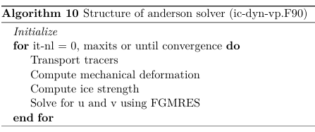

# TO-DO list for IMEX. 

This document is an updated To-Do list for my research at ECCC. I want to put down what has been done and what still needs to be done. 

# Done

### IMEX for B-Grid

The IMplicit-EXplicit (IMEX) has been implemented for the B-grid. The goal with this scheme is to solve for both tracers (A and h) and the velocities in the nonlinear loop. The algorithm goeas as follows for a multicategory model:



### New initialisation for velocity
The speed is now initialised to 2% of the wind for newly formed ice. This helps reducing oscillations in the maximum ice speed during Picard iterations. If not done, it is easier obtaining bad departure points when using IMEX. 

### New preconditionner for pgmres
The coriolis contribution is now taken into accout. This lead to fewer fgmres iterations and increased convergence compared to the diag preconditionner. 

The system of equations being solved is:

$$
D_xw_x - O_yw_y = v_x \\
D_yw_y + O_xw_x = v_y
$$
where $D_i$ and $O_i$ are the diagonal and off-diagonal contributions respectively. The off

This preconditionner can be used by setting 
```
precond_type = 'asym'
```
in PGMRES. 

### New preconditionner for FGMRES
The Bi-Conjugate-Gradient Stable (BiCGSTAB) solver has been implemented for both the C and B-grid. Even with its non-motonocity, it seems that using this solver as preconditionner for FGMRES leads to half less FGMRES iterations. The non-linear norm does not seems to changed compared to pgmres. 


### C-grid implementation for VP dynamics
The VP dynamics can now be solved on the C-grid with a bunch of different solvers. 


# To be Done

